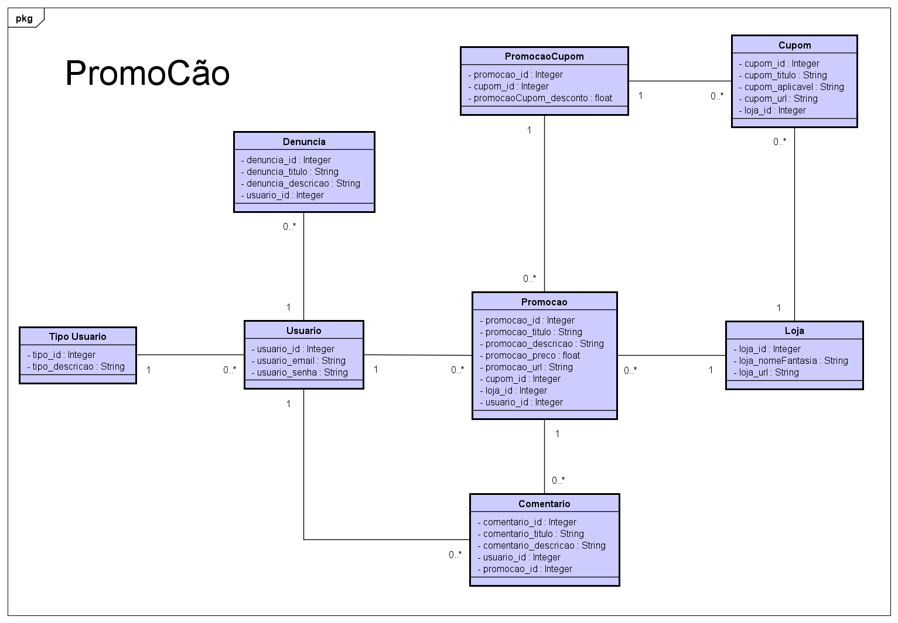

# PromoCao
Projeto básico de PHP com Laravel feito no semestre VI do curso de Análise e Desenvolvimento de Sistemas.

#### Disciplina: Tópicos Especiais em Desenvolvimento de Sistemas PL 2/2022 - Passo Fundo
#### Professor: @guimadalozzo

## Descrição:

&nbsp;&nbsp;&nbsp;&nbsp;&nbsp;&nbsp;PromoCão é um sistema com a ideia principal de abordar o compartilhamento de promoções no ambiente virtual, visto que atualmente, é exorbitante a quantidade de compras feitas on-line. Ele contará com todo o sistema para login e autocadastro, publicação de promoções e a possibilidade de comentá-las, cupons, filtros para melhor navegação e fácil encontro de promoções de maior interesse, como a possiblidade de filtrar por lojas favoritas. 

### Diagrama de Classes:

### Lista de Entregas:
- [X] Parte I (12/09/2022): Entrega GIT com README.md e primeira versão das Migrations
- [X] Parte II (03/10/2022): Entrega de Menu e duas telas de cadastro com padrão de front

### Integrantes do Projeto:
- @Otarossoni
- @SamuelAmarante
